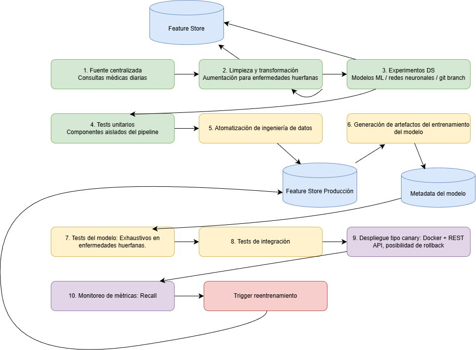

# Pipeline de MLOps — Predicción de enfermedades comunes y huérfanas

---

## Diagrama del pipeline

---

## Puntos de entrada al sistema

El sistema tiene dos puntos de entrada bien diferenciados:

- **API REST (predicción):** el doctor ingresa los síntomas del paciente a través del frontend y el modelo retorna una predicción en tiempo real. La predicción del modelo le sirve al médico como punto de contraste frente a su propio diagnóstico previo, no como reemplazo de este.
- **Batch diario (reentrenamiento):** al final del día se recopilan únicamente las consultas que ya fueron validadas médicamente, es decir, aquellas donde el médico confirmó o corrigió el diagnóstico tras el seguimiento del paciente. Solo estos registros validados se envían a la fuente centralizada para alimentar futuros reentrenamientos.

---

## Descripción de etapas

### Etapa 1 — Centralización de la fuente de datos

Mediante un **proceso batch diario** se recopilan las consultas del día que ya cuentan con diagnóstico médico confirmado y se envían a la base de datos centralizada de datos crudos. Solo ingresan registros validados, lo que garantiza que el reentrenamiento se base en información clínicamente verificada. Los datos se anonimizan antes de almacenarse.
La severidad de los sintomas son categoricos, la duración del sintoma es numérico y la presencia dle sintoma es boolean.

---

### Etapa 2 — Limpieza, transformación y aumentación ↻

A partir de los datos crudos se realiza análisis exploratorio, limpieza, estandarización y generación de features. Se evalúa la viabilidad de técnicas de aumentación (SMOTE, GANs, oversampling) para las enfermedades huérfanas, dado que sus registros validados serán escasos por definición. Esta etapa es **iterativa**: si los datos no son suficientes en cantidad o calidad, se re-evalúa la estrategia antes de continuar. El resultado se guarda en el **Feature Store**.

---

### Etapa 3 — Experimentos DS ↻

Con los datos del Feature Store se ejecutan múltiples experimentos: modelos clásicos (random forest, SVM, XGBoost) como baselines y redes neuronales para capturar relaciones no lineales entre síntomas. Se usa **Git con ramas por experimento**. El criterio de selección prioriza el recall por clase en enfermedades huérfanas. El ciclo se repite hasta identificar la mejor configuración.

---

### Etapa 4 — Tests unitarios

Pruebas sobre los componentes aislados: funciones de preprocesamiento, lógica de aumentación, lectura del Feature Store y formato de salida del modelo.

---

### Etapa 5 — Automatización de ingeniería de datos

El proceso de limpieza y transformación validado en la fase experimental se estandariza como pipeline automática (análogo a arquitectura Medallion: Bronze → Silver → Gold). Se activa cuando el Trigger dispara un reentrenamiento, tomando los registros validados acumulados en la fuente centralizada desde el último entrenamiento.

---

### Etapa 6 — Generación de artefactos

Con los datos del Feature Store de producción se entrena el modelo seleccionado. El artefacto resultante queda versionado en el Model Registry.

---

### Etapa 7 — Tests del modelo

Casos preparados para validar el comportamiento del modelo, con pruebas **exhaustivas en enfermedades huérfanas** (recall mínimo por clase, robustez ante síntomas faltantes o ruidosos).

---

### Etapa 8 — Tests de integración

Validación del flujo completo por los dos puntos de entrada: ingesta del batch con formatos inválidos o registros sin validar, y casos borde en el API REST de predicción. Se verifica coherencia de predicciones y tiempo de respuesta bajo carga.

---

### Etapa 9 — Despliegue canary

El modelo se despliega como **API REST dockerizado**, consumido por el frontend médico para servir predicciones. El despliegue canary expone el nuevo modelo a un porcentaje reducido del tráfico; si las métricas no mejoran o degradan respecto al modelo actual, se ejecuta **rollback automático**.

---

### Etapa 10 — Monitoreo de métricas

Se monitorea el **recall por clase** en producción, con énfasis en enfermedades huérfanas. El ciclo funciona así: el modelo emite una predicción → el médico la contrasta con su diagnóstico → tras el seguimiento del paciente confirma o corrige → ese resultado validado alimenta el cálculo del recall real en producción. Si el recall cae por debajo del umbral definido, se genera una alerta de degradación y se activa el Trigger.

---

### Trigger de reentrenamiento ↻

Al detectar degradación de métricas, el Trigger reinicia el pipeline desde la **etapa 5**, procesando los registros validados acumulados en la fuente centralizada desde el último entrenamiento para generar un modelo actualizado y desplegarlo mediante el flujo canary.

---

## Resumen de ciclos

| Ciclo | Etapas involucradas | Condición de activación |
|---|---|---|
| Re-evaluar aumentación | Etapa 2 → etapa 2 | Datos insuficientes para huérfanas |
| Iterar modelos | Etapa 3 → Feature Store → etapa 3 | Métricas no satisfactorias |
| Reentrenamiento | Monitoreo → Trigger → etapa 5 | Degradación del recall en producción |
| Rollback canary | Etapa 9 (ciclo interno) | Métricas canary peores que modelo actual |
